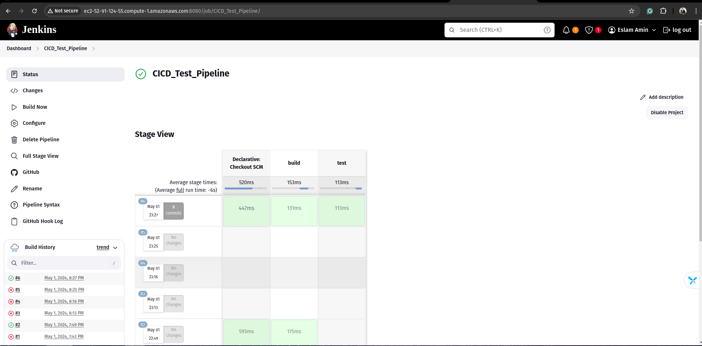
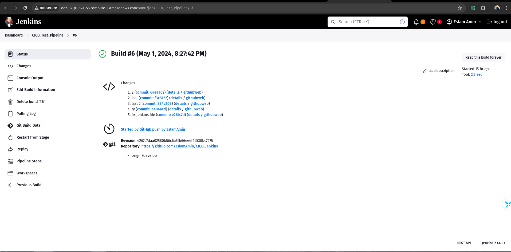

# Jenkins GitHub Integration Proof-of-Concept

A simple proof-of-concept demonstrating Jenkins pipeline integration with GitHub, featuring Gitflow principles and branch protection.

## Table of Contents

- [Overview](#overview)
- [Setup](#setup)
- [GitHub Repository Configuration](#github-repository-configuration)
- [Jenkins Configuration](#jenkins-configuration)
- [GitHub Webhook](#github-webhook)
- [Running the Pipeline](#running-the-pipeline)
- [Branch Protection](#branch-protection)

## Overview

This is the first step of the project,  Jenkins integrated with GitHub to implement a basic pipeline that follows Gitflow principles. The pipeline is triggered by a GitHub webhook and simply prints "Hello, World!" as a placeholder for more complex build, test, and deployment steps which is the next step from this project.

## Setup

1. I created this repo on github
2. Cloned it locally
3. Created a new branch
4.  Created a Jenkinsfile with a simple pipeline job and configured it to use the cloned repository.
5. Installed the `gitflow` plugin for git
6. Configure the GitHub repository rules and webhook.
7. Pushed it on `develop` before creating a pull request for `main`

## GitHub Repository Configuration

Create a new repository on GitHub and set it up to follow the Gitflow branching model. You should have, at a minimum, the following branches:

- `develop`: The main development branch where all new features are merged.
- `master`: The production-ready branch that only receives releases.
- `feature/*`: Feature branches created from `develop` for new features or changes.

## Jenkins Configuration

In your Jenkins pipeline job, use the following pipeline script as a starting point:

```groovy
pipeline {
    agent any
    stages {
        stage('build') {
            steps {
                echo "Hello World!"
            }
        }
        stage('test') {
            steps {
                echo "goodbye Eslam!"
            }
        }
    }
}
```






This script simply prints "Hello, World!" during the pipeline execution.

## GitHub Webhook

After installing the `github api` plugin for jenkins, I added the ec2 instance url  to this repo, so it runs a pipeline on any changes.

## Running the Pipeline

With the Jenkins job and GitHub webhook configured, any push to a branch in the GitHub repository will trigger the Jenkins pipeline. You can test this by pushing a commit to a feature branch and observing the pipeline execution in Jenkins.

## Branch Protection

To enforce Gitflow principles, you can enable branch protection rules in your GitHub repository settings. Restrict direct pushes to the `master` and `develop` branches, requiring pull requests and code reviews for all changes. This ensures that code goes through proper testing and approval processes before being merged.